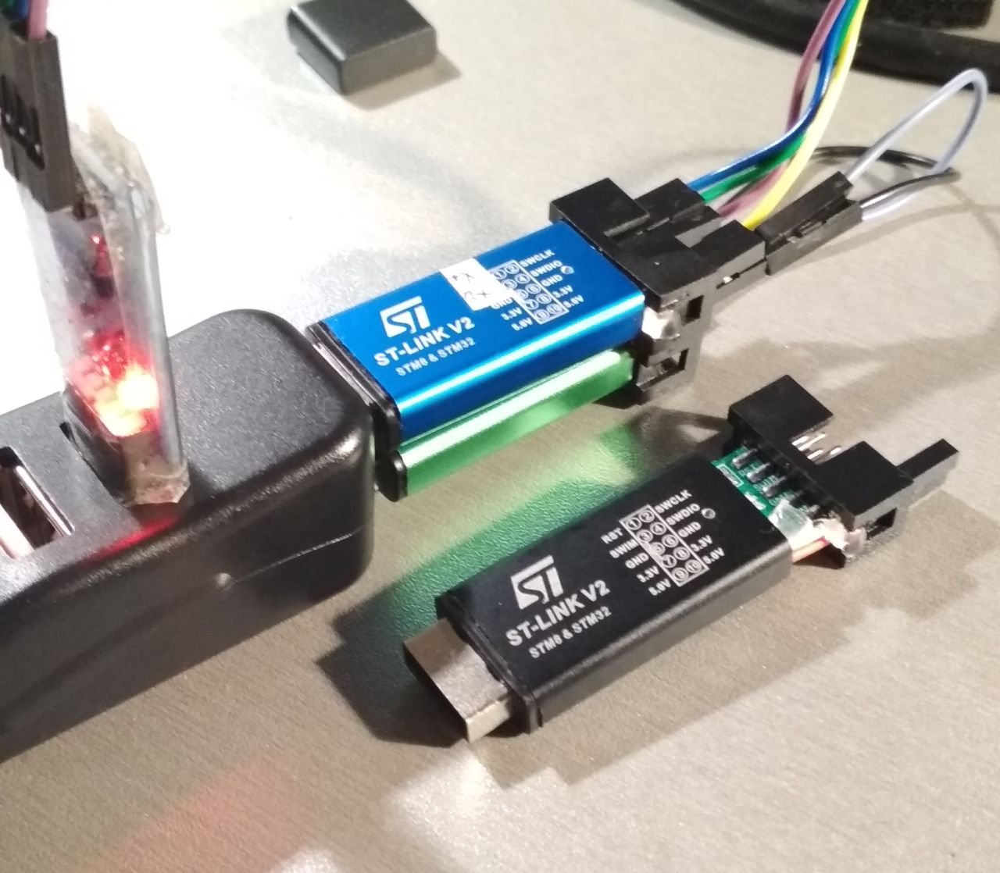

### Espruino build for cheap STLINK V2 clone dongles

Typically they are based on STM32F103 (or clone) chips with 20KB RAM and 128KB flash

Without modification there are 4 GPIOs available marked SWIM,RST,SWIO,SWCLK and there are also SWD pins on test points so easy to reprogram or use as two more GPIOs.

#### Pinout
| Pin   | Description | Comments|
| ------------- | ------------- |----|
| B6 | RST  | UART1 TX, SCL1, also tied to B5 |
| B7 | SWIM | UART1 RX, SDA1, also  tied to B8,B9|
| B13 |SWCLK| also tied to A5|
| B14 |SWDIO| also tied to B12|
| A9 | 1 or 2 LED(s) | if two then writing 1 or 0 lights up LEDs and for turning off let it float or set as input |
| A13 |STM32 SWDIO on PCB| for reflashing via openocd, at runtime can be reconfigured as generic GPIO, swjcfg(4) in code.js|
| A14 |STM32 SWDCLK on PCB| |

#### Installation

With two devices one can be used to reprogram the other via SWD. Often the chip model has only 64KB flash officially while 128KB works so flash size needs to be overrriden.
Also for CKS32 clone chip add `-c 'set CPUTAPID 0x2ba01477'` if it complains about wrong ID.

- Connect `openocd -d2  -f interface/stlink-v2.cfg  -c "set FLASH_SIZE 131072" -f target/stm32f1x.cfg`
- unlock and erase flash `stm32f1x unlock 0`
- program `reset halt; flash write_image erase espruino_2v10.216_stlink_v2.bin 0x08000000`
- now disconnect and reconnect and  open https://www.espruino.com/ide/ -> connect ->'Web Serial'

### Modding

#### SWD
It is quite easy to cut into black sides so that wires from inside can go under metal case and add a row of two pins. This also gives you 2 more generic GIPOs.  

#### Pull ups on SWIM,RST
Some (most?) dongles have 680ohm pull up resistor on SWIM pin. This may cause issues with UART communication as the voltage may not go low enough during communication, also it may possibly cause issues if you repurpose the pin for something else (SPI? I2C?). If you want you can find the resistor on the board and crush/scratch it off in the middle/desolder. Also some other dongles I have has 1K pull up resistors both on SWIM and RST. However this mod is not sctrictly needed if it works for you as is just fine. For more details see images folder but yours may be different, better verify with multimeter.

#### UART2
With some soldering two more GPIO (A2,A3) could be added. When seeing the chip with dot in upper left corner and pin header on left and usb on right A2,A3 are two first corner pins in bottom left corner. Those pins are easier to solder to as they are not in the middle and also they support [additional UART](https://github.com/RadioOperator/STM32F103C8T6_CMSIS-DAP_SWO/blob/master/Doc/STLINK_V2A_V2B/Schematic(part)%20STLINK_V2A_V2B.jpg), hovever current binary build allows only UART1.

#### See also
- https://hackaday.io/project/162597-st-link-clone-repurposing
- https://www.hobbiton.be/blog/repurpose-stlink/stlink2.svg
- https://stm32duinoforum.com/forum/images/thumb/a/ae/Bluepillpinout-gif/wiki_subdomain/700px-Bluepillpinout.gif

### DAP103-STLINKv2.bin

This is CMSIS-DAP build of https://github.com/devanlai/dap42 for stlink v2 dongle that has usb to serial enabled on RST/SWIM pins - using UART1 over B6,B7 pins. This is alternative debugger firmware for using it with OpenOCD, can be used to flash/debug/use second dongle with Espruino with console over RST/SWIM.
